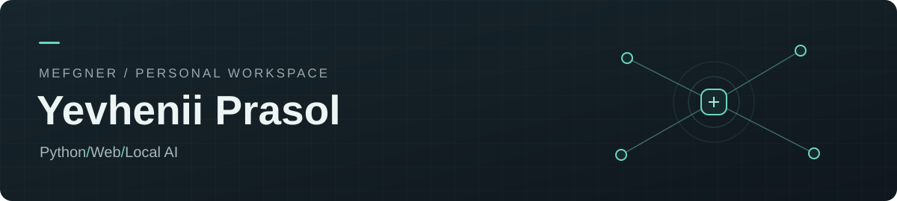

# Hey, I'm Yevhenii — Mefgner online

I like figuring out how things work, then building something I can actually use.

Lately, that has meant working with local AI: getting models running, connecting them to documents, and building the backend and interface around them.

### What I'm building

**[Clyre](https://github.com/Mefgner/Clyre)** — my main project: a self-hosted AI chat app powered by local models. I'm working on the details that make it useful day to day, from streaming responses and file attachments to managing what fits in the model's context.

`Python` · `FastAPI` · `Vue` · `TypeScript` · `llama.cpp`

**[EasyRAG](https://github.com/Mefgner/EasyRAG)** — a small project where I explore how RAG works in practice: turn documents into embeddings, retrieve relevant passages, and use them to answer questions with a local model.

`Python` · `Sentence Transformers` · `Qdrant` · `Docker`

### Small tools, everyday fixes

I also build small utilities for everyday things I'd like to work a little better:

- **[Smart Refresh Rate](https://github.com/Mefgner/SmartRefreshRate)** — switches display refresh rates automatically when a laptop moves between battery and AC power.
- **[Sennheiser Control](https://github.com/Mefgner/SennheiserControl)** — a Windows tray app for controlling my Sennheiser headphones, including EQ settings and battery status.
- **[RapidThemer](https://github.com/Mefgner/RapidThemer)** — one-click light/dark theme toggle from the system tray — portable PowerShell app, no install, no admin.
- **[HideDotFolders](https://github.com/Mefgner/HideDotFolders)** — lightweight Windows service that hides dotfiles in your profile root (non-recursive, with allowlist).

### Tools I work with

### What keeps me curious

How does a model find the right information? What should an application keep in context? And how do you turn a working experiment into something pleasant to use?

Those are the kinds of questions I'm exploring through my projects.
